  

<h1 align="center">
  
</h1>

  I build production-ready <b>AI-powered products</b>, <b>full-stack platforms</b>, and <b>automation workflows</b> 
  using <b>FastAPI, React, LangChain, Supabase, Celery, Redis, and PostgreSQL</b>.

  <i>Most recently: Full Stack Engineer – AI Agents at <b>Amplitude Ventures</b> (Stavanger, Norway)</i>

---

## 🚀 What I Do

- **AI Agents & LLM Integrations**  
  LangChain, LangGraph, OpenAI APIs, Pinecone, multi-step workflows, and autonomous decision-making systems  

- **Full-Stack Web Apps**  
  FastAPI / Laravel / Node.js backends with React + TypeScript frontends — shipped across legal tech, CRM, and music platforms  

- **Backend & Infrastructure**  
  Celery + Redis distributed task processing, async Python, CI/CD pipelines with security QA gates  

- **High-Traffic Platforms**  
  Designed and launched platforms handling 800k+ monthly page views with zero paid acquisition  

---

## 🔧 Tech Stack

### Core Stack (day-to-day)

**Backend:** Python · FastAPI · Flask · Django · Laravel · Celery · Redis · Node.js · NestJS  
**Frontend:** React · TypeScript · Tailwind CSS · Vite · shadcn/ui · HTML5/CSS3  
**AI & Automation:** LangChain · LangGraph · OpenAI GPT-4 · Pinecone · Prompt Engineering  
**Data & Infra:** PostgreSQL · MySQL · Supabase · AWS (EC2, S3, RDS) · Supabase Edge Functions  
**DevOps:** Git/GitHub · CI/CD (GitHub Actions) · OAuth 2.0  

### Languages & Tools (at a glance)

  

---

## ⚡ Stats

 

  
  
  

## 📫 Let's Connect
 

  
  
  
  
  

